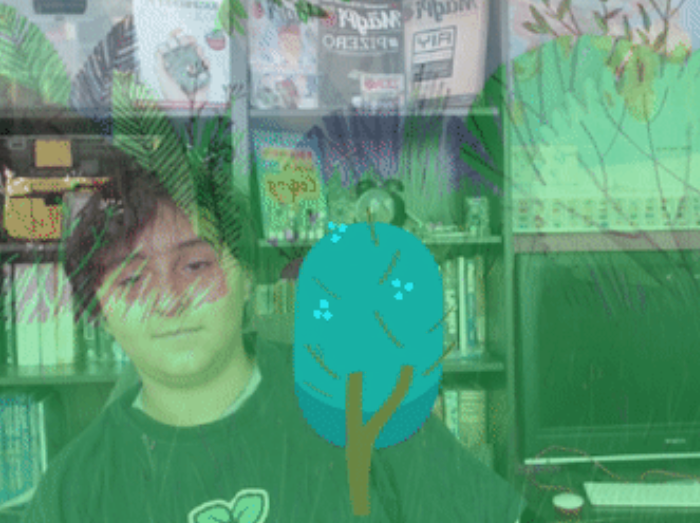

## Introduction

How still can you be? Make a movement detector using the Scratch `Video Sensing`{:class="block3extensions"} extension blocks. The camera detects a player's movement — the stiller the player is, the more the tree will grow. Doing nothing is the aim of this game!

### What you will make

--- no-print ---

--- /no-print ---

--- print-only ---

--- /print-only ---

--- collapse ---
---
title: What you will need
---
### Hardware

+ A computer or tablet, with a camera, capable of running Scratch

### Software

+ Scratch 3 (either [online](https://scratch.mit.edu/){:target="_blank"} or [offline](https://scratch.mit.edu/download){:target="_blank"})

### Downloads

+ If you are working offline, download the [project starter file](http://rpf.io/p/en/grow-a-tree-go){:target="_blank"}

--- /collapse ---

--- collapse ---
---
title: What you will learn
---

+ How to use the Scratch extension `Video Sensing`{:class="block3extensions"}
+ How to use the conditions `if ... then`{:class="block3control"} and `if ... then ... else`{:class="block3control"}

--- /collapse ---

--- collapse ---
---
title: Additional information for educators
---

If you need to print this project, please use the [printer-friendly version](https://projects.raspberrypi.org/en/projects/grow-a-tree/print){:target="_blank"}.

--- /collapse ---
