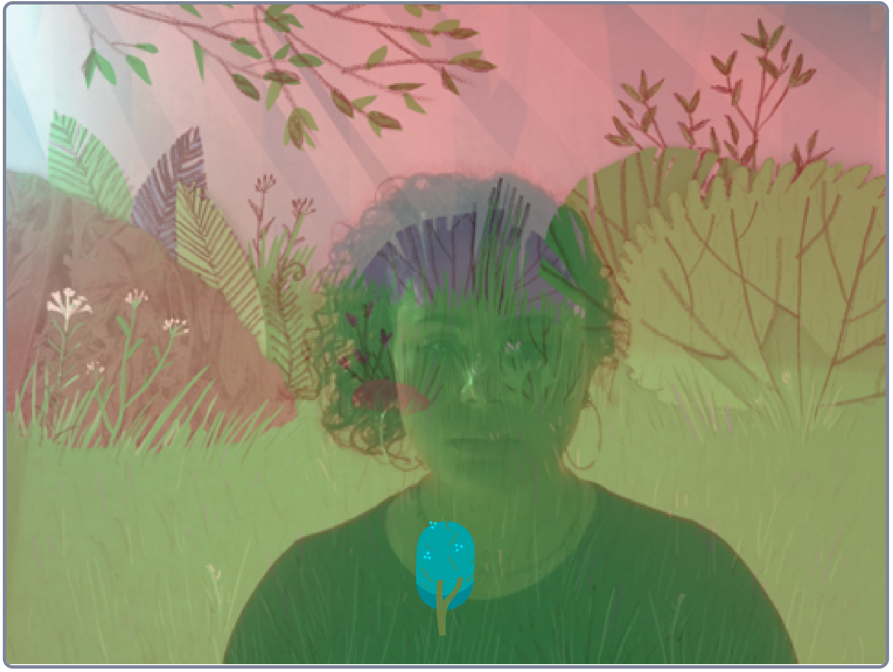

## Introduction

How still can you be? Make a movement detector using Scratch's Video Sensing block. The camera detects a player's movement - the stiller the player is, the more the tree will grow. Doing nothing is the aim of this game!

### What you will make

--- no-print ---

--- /no-print ---

--- print-only ---

--- /print-only ---
--- collapse ---
---
title: What you will need
---
### Hardware

+ A computer capable of running Scratch

### Software

+ Scratch 3 (either online or offline)

### Downloads

+ To open this project offline, follow the link to the Scratch Offline Editor: [www.scratch.mit.edu/download](https://scratch.mit.edu/download){:target="_blank"}.

--- /collapse ---

--- collapse ---
---
title: What you will learn
---

+ Use the Scratch Extension Block; `Video Sensing`{:class="block3extensions"}
+ Introduction to conditions; `if () then`{:class="block3control"} and `if () then, else`{:class="block3control"}

--- /collapse ---

--- collapse ---
---
title: Additional information for educators
---

If you need to print this project, please use the [printer-friendly version](https://projects.raspberrypi.org/en/projects/project-name/print){:target="_blank"}.

[Here is a link to the resources for this project](http://rpf.io/project-name-go).

--- /collapse ---
