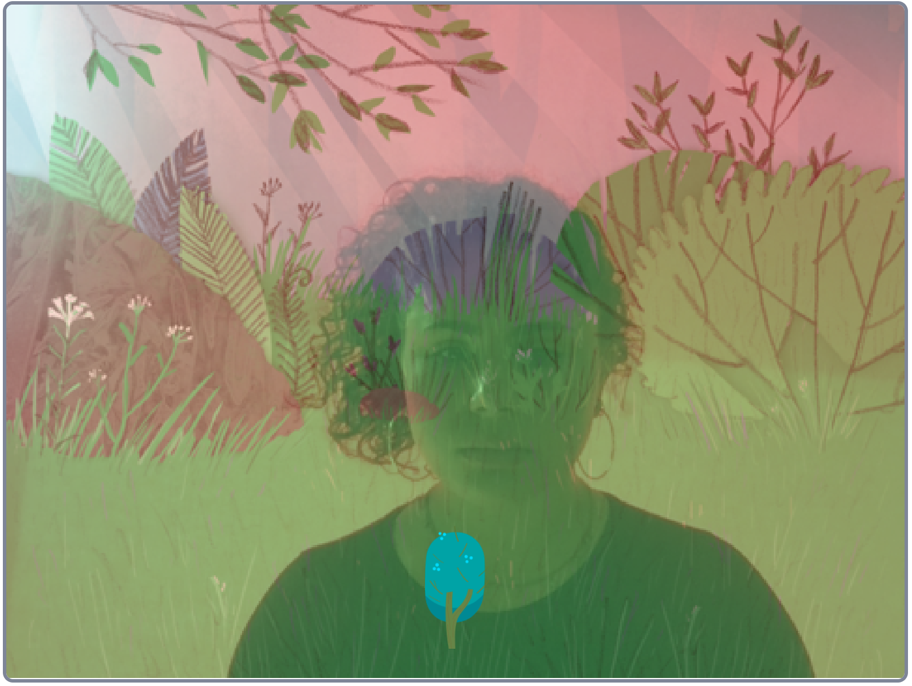

## How still can you be?

**Online**: Open the 'Grow a tree' starter Scratch project [www.rpf.io/grow-a-tree-on](http://rpf.io/grow-a-tree-on){:target="_blank"}.

To open this project offline, follow the link to the Scratch Offline Editor: [www.scratch.mit.edu/download](https://scratch.mit.edu/download){:target="_blank"}.

You can then download the Starter project at [rpf.io/grow-a-tree-go](http://rpf.io/grow-a-tree-go).

If you have a Scratch account you can make a copy by clicking **Remix**.

You should see yourself with a wood in the background and a tiny tree. The project works best in full screen mode. Click the green flag to play the game. Stay very still and the tiny tree will grow and grow. If you move, the tree will shrink in size.

--- no-print ---

--- /no-print ---

--- print-only ---

--- /print-only ---

## Set the screen

You're going to work on the first part of the program to make Tree sprite a little bigger because Tree sprite is difficult to see at the start of the game. You're also going to improve the instructions for the player!

--- task ---
+ Open the code editor. 

+ `when green flag clicked`{:class="block3events"} starts the game. 

+ Tree sprite is scaled to 10% of its actual size. Start the tree at a larger percentage (%).
```blocks3
set size to [10%] ::looks
```
+ The instructions currently say "Keep still!". That's a bit dull. Can you make the instructions more fun?
```blocks3
say [Keep still!] for (2) seconds ::looks
```
+ Run the program to check your changes.
--- /task ---

## Build the camera detector
That's the set-up done. A `forever`{:class="block3control"} block wraps around the rest of the program so it runs forever (or until the game ends).

Inside the `forever`{:class="block3control"} block are two conditions: `if () then`{:class="block3control"} and `if () then, else`{:class="block3control"} - they are great for developing user interaction. Let's see how.

The `Video Sensing`{:class="block3extensions"} is set to pick up any motion on the stage.
```blocks3
<(video [motion v] on [stage v] ::video) < (10)>
```
In the first condition, if the player moves less than 10 then, the size of Tree sprite increases by 1, else Tree sprite shrinks by -1.

```blocks3
	if <(video [motion v] on [stage v] ::video) < (10)> then ::control 
		change size by (1) ::looks
	else 
		change size by (-1) ::looks ::control
	end
```
Shrinking Tree sprite by -1 is the player's punishment for moving too much!.

--- task ---
+ Test the game for future players by changing the amount Tree sprite grows or shrinks.
```blocks3
change size by (1) ::looks
```
```blocks3
change size by (-1) ::looks
```
+ Run the program again to check your changes. Top tip: cover the computer's camera with your finger to test your changes.
--- /task ---
Does the game feels more responsive when you increase and/or decrease Tree sprite's size? These are the kind of things that Games Developers have to consider when designing for user interaction.

## Stop Tree sprite from getting too big!
Let's explore the second condition.

If Tree sprite touches the edge of the stage then the `say`{:class="block3looks"} block says "Well done!". Also included in this action is `stop this script`{:class="block3control"} - this stops the Tree sprite from growing so the tree doesn't get too big for the stage. `stop this script`{:class="block3control"} also stops the forever block.
```blocks3
if (touching [edge v] ? ::sensing) then ::control
			say [Well done!] for (2) seconds ::looks
			stop [this script v]
```
--- task ---
+ Test the second condition by dragging the blocks highlighted above away from the main script in the Scratch project. 

+ Run the program again. Does Tree sprite just keep on growing?

+ Now, drag the blocks back in to the script again.

+ Run the program to check your changes.
--- /task ---
