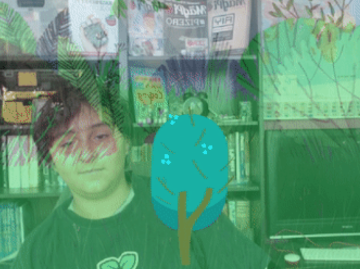

## How still can you be?

**Online:** open the [starter project](http://rpf.io/grow-a-tree-on){:target="_blank"} in Scratch.

**Offline:** open the [project starter file](http://rpf.io/p/en/grow-a-tree-go){:target="_blank"} in the Scratch offline editor. If you need to, you can [download and install Scratch here](https://scratch.mit.edu/download){:target="_blank"}.

You should see yourself with a wood in the background and a tiny tree. The project works best in full-screen mode. Click on the green flag to play the game. Stay very still, and the tiny tree will grow and grow. If you move, the tree will shrink.

--- no-print ---

--- /no-print ---

--- print-only ---

--- /print-only ---

## Set the screen

The **Tree** sprite is difficult to see at the start of the game. First, you will work on the program to make the **Tree** sprite bigger. You will also improve the instructions for the player!

--- task ---
+ Open the **Code** tab.

+ `when green flag clicked`{:class="block3events"} starts the game. 

+ The **Tree** sprite is scaled to `10` percent of its actual size. Increase the value in the `set size to`{:class="block3looks"} block so that the **Tree** sprite is a bigger size at the start of the program.
```blocks3
set size to [10%] ::looks
```
+ The instructions currently `say`{:class="block3looks"} "Keep still!". That's a bit dull. Can you make the instructions more fun?
```blocks3
say [Keep still!] for (2) seconds ::looks
```
+ Run the program to check your changes.
--- /task ---

## Build the movement detector
The setup is finished. A `forever`{:class="block3control"} block wraps around the rest of the program so that it runs forever (or until the game ends).

Inside the `forever`{:class="block3control"} block, there are two conditions: `if ... then`{:class="block3control"} and `if ... then ... else`{:class="block3control"}. They are great for developing user interaction. Here, you will see how.

The `Video Sensing`{:class="block3extensions"} block is set to pick up any motion on the Stage.
```blocks3
<(video [motion v] on [stage v] ::video) < (10)>
```
In the first condition, if the player moves less than `10`, then the size of the **Tree** sprite increases by `1`, else the **Tree** sprite shrinks by `-1`.

```blocks3
	if <(video [motion v] on [stage v] ::video) < (10)> then ::control 
		change size by (1) ::looks
	else 
		change size by (-1) ::looks ::control
	end
```
Shrinking the **Tree** sprite by `-1` is what happens when the player moves too much!

--- task ---
+ To try to improve the game for future players, change the amount that the **Tree** sprite grows or shrinks.

```blocks3
change size by (1) ::looks
```
```blocks3
change size by (-1) ::looks
```
+ Run the program again to check your changes. **Tip:** Cover the computer's camera with your finger to test your changes.

--- /task ---

Does the game feel more responsive when you increase and/or decrease the size of **Tree** sprite? These are the kinds of things that games developers have to consider when designing for user interaction.

## Stop the **Tree** sprite from getting too big!
Next, explore the second condition.

If the **Tree** sprite touches the edge of the Stage then the program `says`{:class="block3looks"} "Well done!". This action also includes `stop this script`{:class="block3control"}. This stops the **Tree** sprite from growing, so that the tree doesn't get too big for the Stage. The `stop this script`{:class="block3control"} block also stops the `forever`{:class="block3control"} block.
```blocks3
if (touching [edge v] ? ::sensing) then ::control
			say [Well done!] for (2) seconds ::looks
			stop [this script v]
```
--- task ---

+ To test the second condition, drag the blocks highlighted above away from the main script in the Scratch project. 

+ Run the program again. Does the **Tree** sprite keep growing?

+ Now, drag the blocks back into the script again.

+ Run the program to check your changes.
--- /task ---
